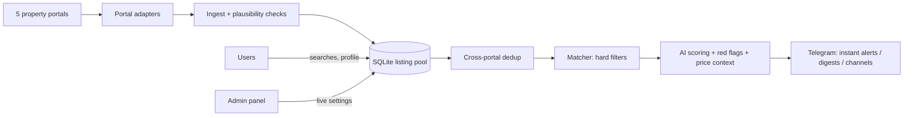

  

<h1 align="center">WohnKompass</h1>

  <b>A Telegram bot that finds flats, houses and WG rooms in Austria while they are still free.</b> 
  Five portals · AI fit score · seven languages · live beta

  <a href="https://t.me/wohnkompass_bot">Try the bot</a> ·
  <a href="https://wohnkompass.freshdesign.at">Website</a> ·
  <a href="https://github.com/SwitchmanPlay/wohnkompass-web-showcase">Website showcase</a>

> **About this repository.** The source code of WohnKompass is private because it is a
> commercial product. This page explains what I built, how it works and which tools I
> used, so you can judge the work without the code. Happy to walk through the real code
> in an interview.

---

## The problem

In Vienna a good flat can be gone a few hours after it is listed. Listings are spread over
several portals, the same flat is often posted on more than one of them, and ads are full
of local catches that newcomers do not know about (fixed-term leases, key money, agent
commission, subsidised flats that need a special ticket).

## What the bot does

- **Watches five Austrian portals** (willhaben, ImmoScout24, immowelt, derStandard
  Immobilien, WG-Gesucht) and removes cross-posted duplicates.
- **Rent and buy**, for flats, houses and WG rooms. A guided wizard asks for city, district,
  budget, size and rooms. Vienna plus seven more Austrian cities.
- **AI fit score from 1 to 10** with a one-line reason in the user's language. Premium
  users can have the listing photos scored too.
- **Red-flag warnings without AI**: fixed-term lease, key money (Ablöse), agent commission,
  subsidised housing that needs a Wohn-Ticket.
- **Price context** against the typical price in that district, plus a weekly market report.
- **One-tap application letters** that answer what the ad actually asks.
- **"Quiet search coach"**: when a search finds nothing, the bot explains why and offers a
  one-tap way to widen it.
- **Seven languages**: English, German, Russian, Ukrainian, Turkish, Arabic, Persian
  (including right-to-left layouts).
- **Freemium model**: a free 12-hour digest, paid instant alerts, payments via Telegram
  Stars or crypto, referral rewards and promo codes.
- **Privacy**: users can delete all their data with one command; backups are encrypted.
- **Admin panel inside Telegram**: statistics, per-portal health, AI model chains, feature
  switches and campaigns, all changeable at runtime without a restart.

## How it works

The key design choice: listings are collected **once per portal, city and deal type, not
once per user**. Every user is matched against one shared pool, so adding users adds no
load on the portals and the running cost stays flat.

## Engineering highlights

| | |
| --- | --- |
| **896 automated tests** | Fully offline, fixture-based `unittest` suite (51 test files, ~11k lines of tests). |
| **~23k lines of Python** | Async Python, built and shipped in two weeks of focused work (69 commits). |
| **Parsing that survives redesigns** | Each portal adapter tries several extraction strategies and keeps the one that returns the most listings. A new portal is roughly a 20-line spec. |
| **"Wrong data is worse than no data"** | Every listing passes plausibility checks (Austrian postcode, realistic price ranges, the right city). This came from a real bug where one portal returned listings from Stuttgart for a Vienna search. |
| **Self-monitoring** | One failing portal never stops the others. The bot notices a source that "looks healthy but returns nothing", alerts the admin and pauses it. |
| **Reliable AI** | Each AI task has an ordered chain of models across several providers. A reply only counts if it is a valid verdict, otherwise the next model is tried. A dashboard tracks the success rate per model. |
| **Prompt-injection aware** | Listing text is treated as untrusted. The model never gets tools; the app parses its text answer and validates it. |
| **Safe money paths** | Stale or tampered invoices are refused, and a paid charge is always granted. |
| **i18n discipline** | A test enforces that all seven languages have the same keys and placeholders. |
| **Learning from production** | The first live week produced a list of incidents; each became a fix with a regression test. |

## Tech stack

| Area | Tools |
| --- | --- |
| Language | Python 3.11+ (async/await) |
| Bot framework | python-telegram-bot 21 (job queue, rate limiter) |
| HTTP | httpx (HTTP/2), polite rate-limited collection of public listing pages |
| Data | SQLite in WAL mode, additive-only schema migrations |
| AI | OpenRouter and OpenAI-compatible APIs; open models such as Qwen3, Gemma 3 and Llama 3.3, plus a vision model for photos |
| Payments | Telegram Stars, crypto payment gateway |
| Security | Fernet-encrypted backups (`cryptography`), hardened systemd service |
| Testing | `unittest`, offline fixtures shaped like real portal responses |
| Ops | Linux VPS (Ubuntu 24.04), systemd, Bash and PowerShell deploy scripts |
| Development | Git, GitHub, **Claude Code** (AI-assisted development) |

## Skills this project shows

Async Python · Telegram Bot API and conversational UX · web data extraction and
normalisation · deduplication and data-quality checks · LLM integration with fallback
chains and output validation · SQLite schema design · automated testing · Linux and
systemd operations · payments · localisation incl. RTL · GDPR-minded design · product and
pricing design · working effectively with AI coding agents

## Status

Live beta with real users since September 2026. The landing page is a separate project:
see the [WohnKompass website showcase](https://github.com/SwitchmanPlay/wohnkompass-web-showcase).
WohnKompass grew out of my earlier bot [DealKompass](https://github.com/SwitchmanPlay/dealkompass-showcase).

---

Built by <a href="https://github.com/SwitchmanPlay">Danylo Prokhorenko</a>, Vienna ·
<a href="https://portfolio.freshdesign.at">portfolio</a> · danyaprokhorenko@gmail.com
